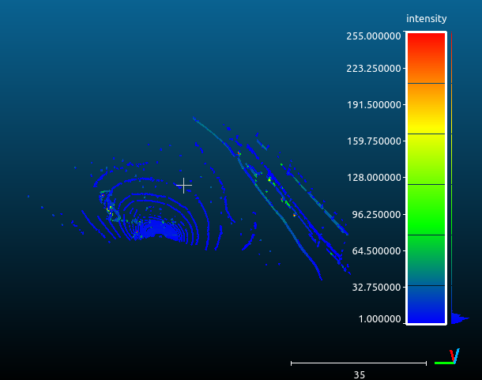
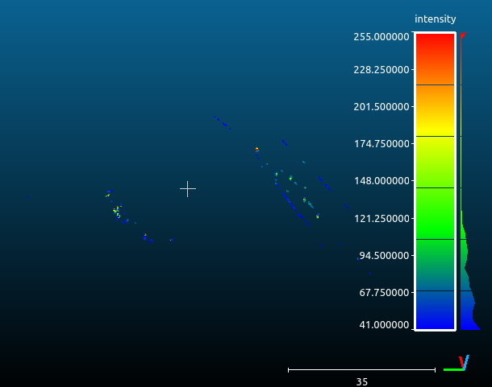

# Tarea de Admisión: Percepción (ARUS)

Este repositorio contiene la solución a las tareas de admisión para el departamento de Percepción. El objetivo principal es el filtrado de una nube de puntos (LiDAR) para eliminar el suelo y aislar los conos del circuito.

## Tarea 1: Razonamiento del Algoritmo

Necesitamos eliminar el suelo de la nube de puntos sin perder los datos de los conos; para ello, debemos buscar una forma de diferenciar el suelo. En la nube de puntos, el suelo es el plano que contiene más puntos. Por lo tanto, el problema se reduce a encontrar un algoritmo capaz de hallar este plano.

### Ajuste del plano
El algoritmo selecciona subconjuntos aleatorios de tres puntos (X, Y, Z) para proponer un modelo de plano. Mediante este proceso iterativo (RANSAC), se identifica el plano que contiene el mayor número de puntos coincidentes, permitiendo separar el suelo.

### Tratamiento de rugosidad
Para gestionar el ruido y las irregularidades del terreno, se introduce un umbral (threshold) respecto al plano estimado.  
Este umbral permite descartar puntos pertenecientes al suelo.

### Optimización del algoritmo
Además, podemos optimizar este algoritmo para reducir el coste computacional gracias al dato del ring y la intensidad con la que se devuelve el punto:
* **Rings:** Los rings de menor índice son los de la parte inferior del LiDAR, que impactan mayoritariamente en el suelo. Por ello, se restringe la búsqueda a estos en vez de tener que iterar entre todos los puntos de la nube.
* **Intensidad:** El asfalto devuelve una intensidad menor que la del plástico de los conos. Este dato nos permite eliminar puntos que, a pesar de estar fuera del plano, no pertenecen a los objetos de importancia.

### Uso de RANSAC (PCL)
Para evitar implementar el algoritmo desde cero, utilizaremos la librería **PCL (Point Cloud Library)**, que incluye **RANSAC**, un algoritmo iterativo utilizado para estimar los parámetros de un modelo matemático, permitiéndonos centrar nuestros esfuerzos en la lógica de filtrado y optimización de los parámetros.

### Filtrado final
Una vez obtenido el plano del suelo, se realizará el filtrado final utilizando:
* **Distancia al plano:** Se conservarán los puntos fuera del umbral definido.
* **Intensidad:** Se conservarán los puntos con una intensidad reflejada superior a la media reflejada del suelo.

Solo los puntos que cumplan ambos criterios serán conservados en el resultado final.

---

## Tarea 2: Implementación (C++)

La implementación se ha realizado en **C++** utilizando **Ubuntu 22.04**.

### Requisitos previos
* **Herramientas de desarrollo** (C++, CMake, Git):
```bash
sudo apt install build-essential gdb cmake git -y
```
* **CloudCompare** para la visualización de resultados.
```bash
sudo snap install cloudcompare
```
* **PCL** (Point Cloud Library):
```bash
sudo apt install libpcl-dev pcl-tools -y
```

## Compilar el proyecto

``` bash
mkdir build && cd build
cmake ..
make
./eliminar_suelo ../saved_pointcloud.pcd
```

---

## Resultados
Se observa que el suelo ha sido eliminado de forma consistente, conservando la estructura completa de los conos y reduciendo significativamente el ruido residual.

| Antes del procesamiento | Después del procesamiento |
|-------------------------|---------------------------|
|  |  |

## Problemas y Soluciones
* **Ruido:** Al aplicar un umbral de distancia (threshold) elevado para absorber las irregularidades del asfalto, se seguía generando mucho ruido residual. Si se eleva más el umbral, se eliminaría la base de los conos, y si se dejaba igual, seguiría apareciendo ruido.

    * **Solución:** Se implementó un filtrado de doble criterio. En lugar de confiar solo en el umbral, se utilizó la intensidad del punto. Dado que el material de los conos refleja más que el asfalto, se eliminan los puntos que, aun estando fuera del plano, no superaban un nivel de intensidad mínimo.

## Trabajo futuro
* **Intensidad:** En lugar de establecer un umbral fijo para el filtrado por intensidad, calcular la media de las intensidades de los puntos pertenecientes al plano estimado y utilizarla como referencia dinámica.


    


